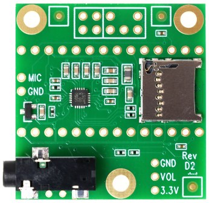
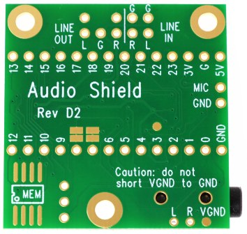
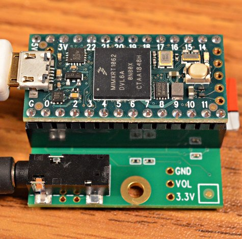
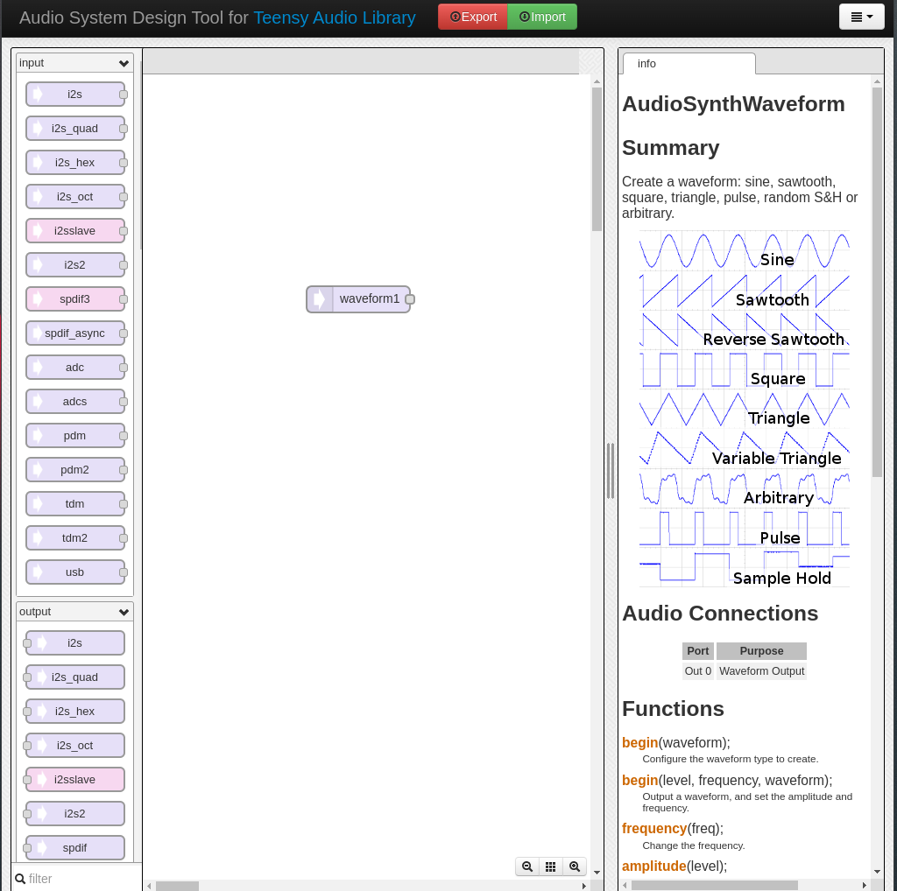
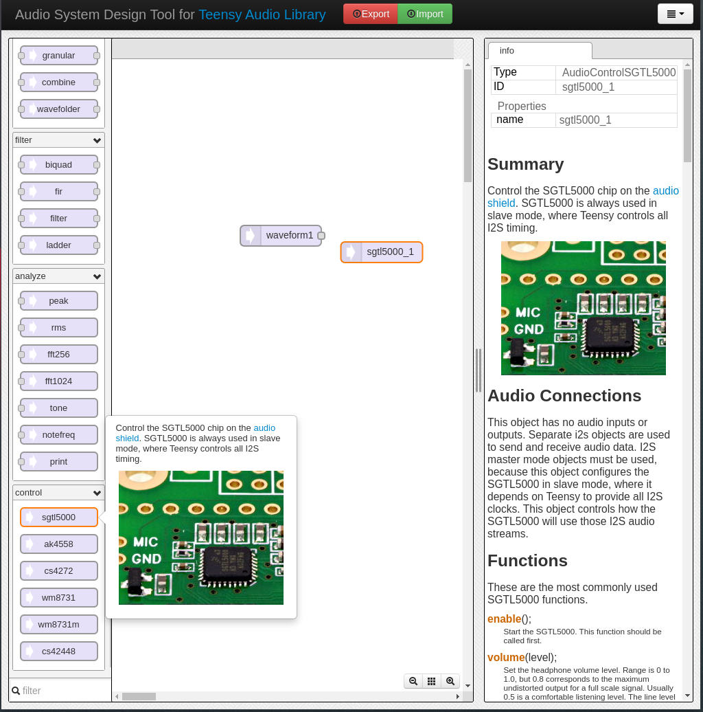
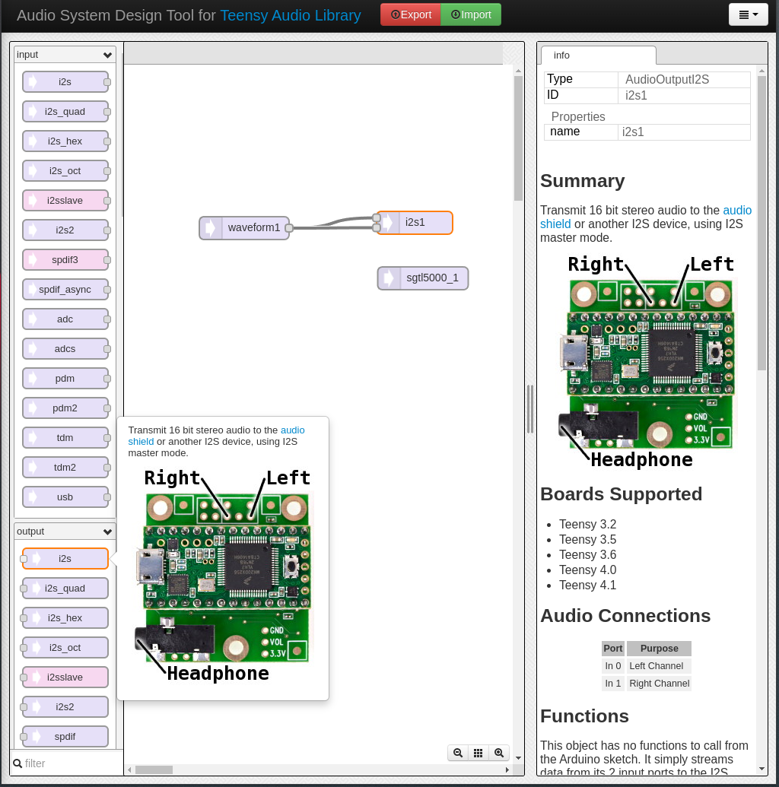
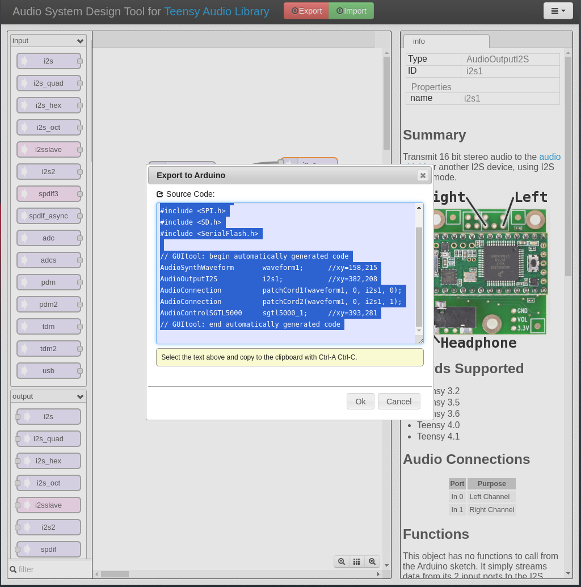
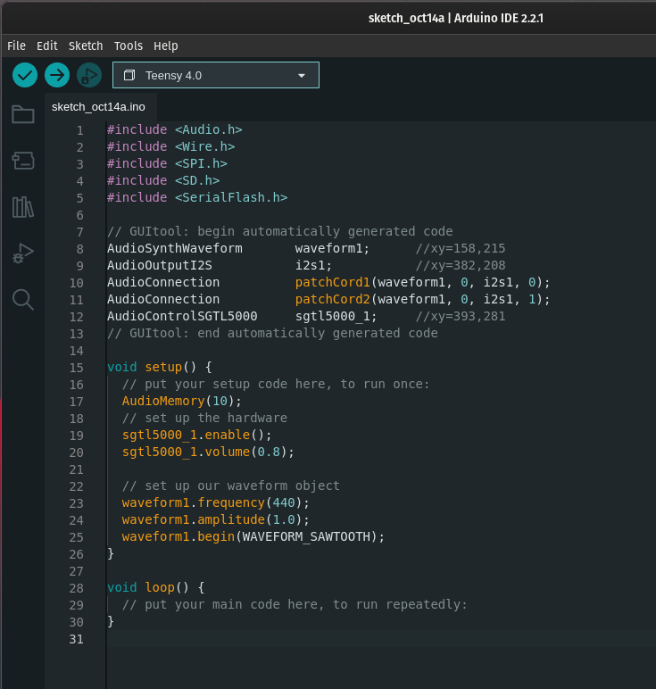

Music programming / Digital Signal Processing with [Teensy](https://www.pjrc.com/teensy/).

> A toolkit for building streaming audio projects, featuring Polyphonic Playback, Recording, Synthesis, Analysis, Effects, Filtering, Mixing, Multiple Simultaneous Inputs & Outputs, and Flexible Internal Signal Routing.

Taken from [PJRC](https://www.pjrc.com/)'s website.

---

## INTRODUCTION

The Teensy's built-in [Audio library](https://www.pjrc.com/teensy/td_libs_Audio.html), in conjunction with compatible [audio shields](https://www.pjrc.com/store/teensy3_audio.html), offers a powerful platform for producing high-quality sound and audio processing. Teensy's Audio library provides a versatile set of tools for managing audio input and output, allowing users to create synthesisers, music players, and sophisticated audio effects. The key advantage is the Teensy's ability to handle these tasks with minimal latency, ensuring that audio signals are processed and delivered in real time.

In this section, we will acquaint you with some fundamental programming concepts, but first we will guide you through the practical application of the Audio Shield.

## TEENSY AUDIO SHIELD

The Audio Shield is a versatile audio processing add-on board designed to enhance the capabilities of Teensy development boards. 

| Front — Rev D2 (for Teensy 4.x series) | Back — Rev D2 (for teensy 4.x series)  |
| --- | ---- |
|| |

### Features
The Teensy Audio Shield is a feature-rich audio processing add-on board

* **Audio Outputs:** The shield includes a 1/8-inch (3.5mm) stereo audio jack. This headphone output is equipped with a built-in amplifier for driving headphones directly, providing a convenient way to listen to audio without the need for an external amplifier. It also includes soldering pads for stereo line-level output, labelled `LINE OUT`, which can be connected to an external audio amplifier, or other devices with line-level inputs like mixers or audio interfaces.

* **Audio Inputs:** While the shield doesn't have onboard audio input jacks, it provides dedicated pads for soldering external audio input connections. It allows you to add a microphone, through the `MIC` input, and has 2 line-level inputs, `LINE IN` for line-level input signals. This offers flexibility for various audio input sources based on your project's requirements.

* **Audio Codec Chip:** At the heart of the Audio Shield is the SGTL5000 audio codec chip. This chip, manufactured by NXP Semiconductors, is known for its high-quality audio performance. It features a 24-bit stereo DAC (Digital-to-Analog Converter) and a 24-bit stereo ADC (Analog-to-Digital Converter), offering excellent audio fidelity for both input and output.

* **Digital Signal Processor (DSP):** One of the standout features of the Teensy Audio Shield is its built-in DSP. This allows real-time audio effects processing, making it suitable for audio synthesis, filtering, equalisation, and various other audio manipulation tasks.

* **SD Card Slot:** For audio recording and playback, the shield incorporates an SD card slot. This feature lets you store and retrieve audio data from an SD card, making it suitable for sound file storage and retrieval in applications like music players or voice recorders.

### Board Compatibility
The Teensy Audio Shield is compatible with specific Teensy board models, and the choice of compatibility depends on the revision of the Teensy Audio Shield. It's essential to ensure that the shield aligns with your Teensy board to work seamlessly. Below are the compatibility details for various Teensy Audio Shield revisions:

* **Teensy Audio Shield Rev A and Rev B:** These earlier revisions of the Teensy Audio Shield were primarily designed for use with Teensy 3.x series boards, such as Teensy 3.0, 3.1, and 3.2.

* **Teensy Audio Shield Rev C and Rev D:** Rev C's are optimised for use with Teensy 3.x series boards, including Teensy 3.2. While Rev D's, are meant to be used with Teensy 4.x series boards.

* **Teensy Audio Shield Rev D2:** We will be using this revision of the Audio Shield, which is primarily designed for use with Teensy 4.x series boards, including Teensy 4.0, 4.1, and 4.2. It may not be fully compatible with Teensy 3.x series boards due to differences in pinout and voltage levels.

**_For more information on the Audio Shield and Teensy in general please refer to PRJC's [website](https://www.pjrc.com/store/teensy3_audio.html)._**

### Connecting the Audio Shield to the Teensy

We will be using stackable headers to connect our Teensy board to our audio shield. It's worth mentioning that the headers on your boards may arrive pre-soldered, but occasionally, they may be supplied as kits, requiring the manual soldering of pin headers onto each board.

The order of placement, whether the Audio Shield is on the top or bottom, is not crucial. What you should be attentive to is the orientation of the boards. Typically, you'll find that the micro USB socket is on the same side as the Teensy's audio jack, with both boards oriented so that their fronts are facing upward.



## TEENSY AUDIO LIBRARY

This library operates through the [Audio System Design Tool](https://www.pjrc.com/teensy/gui/index.html), a user-friendly graphical user interface (GUI) accessible in your web browser. Within this interface, you can effortlessly incorporate, create instances of, and establish connections between various objects, simplifying the process of building and configuring your desired components. Before immersing ourselves in this tool, let's take a moment to explore a couple of programming concepts associated with the notion of libraries.

### What's a library?

In programming, a library refers to a collection of pre-written code modules and functions that can be used by developers to simplify their programming tasks. These libraries are typically designed to perform common operations, provide specific functionality, or interact with hardware components.

In the context of Arduino and Teensy, libraries play a crucial role in extending the capabilities of these platforms. They offer a way to easily access and use complex hardware features or perform intricate tasks without having to write all the code from scratch. For example, Teensy's library provide a wealth of resources, ranging from audio processing to sensor interfacing.

### What's this Audio Library about?

Teensy's Audio Library is a specialised library designed to facilitate real-time audio processing and synthesis on Teensy microcontrollers.  

In simplistic terms, the Teensy Audio Library comprises a series of "objects" representing different audio components or processors. An object is essentially a self-contained unit of code that encapsulates data and functions, designed for specific purposes. These objects can be thought of as building __blocks__ that you can use in your code to perform various tasks. Each block is pre-coded to carry out a particular audio function, whether it's generating waveforms, applying effects, or routing audio signals. By creating and configuring these objects, you can construct complex audio processing chains. 

### [Teensy's Audio Design System Tool](https://www.pjrc.com/teensy/gui/index.html)

Having gained a brief understanding of libraries and objects, we are now prepared to delve into the intricacies of this [audio tool](https://www.pjrc.com/teensy/gui/index.html) and construct our initial basic system: a continuous and sustained musical note, commonly known as a drone.



The interface is structured into three distinct columns or sections. On the left-hand side, you'll find a comprehensive collection of building blocks and objects at your disposal. These elements are thoughtfully categorised based on their module type and the specific functions they serve, encompassing inputs, outputs, effects, filters, controls, and more. On the right-hand side, you'll discover a wealth of information pertaining to the selected object. This includes a concise overview of its functions, details on the programming methods available for modifying the object's parameters and behaviours in our code, and practical usage examples with relevant files that can be found in this [github repository](https://github.com/PaulStoffregen/Audio/tree/master/examples).
 In the centre, the canvas, is our workspace where you can effortlessly drag and drop these building blocks to assemble and configure your audio system.

We will start with the **AudioSynthWaveform** object. As a default, this object is readily available within our workspace and is labeled as _waveform1_. Here, _waveform1_ serves as the object's unique identifier, which we will employ in our code to reference it. If needed, we can easily rename this object by performing a double-click on it. 

The **AudioSynthWaveform** object is a versatile tool for generating various audio waveforms, which are fundamental for sound synthesis. As mentioned in the info tab, this component allows you to create waveforms like sine waves, square waves, sawtooth waves, triangle waves, and so on. We can also see that this object has a single audio connection _Out 0_.

_(Note: if you are not familiar with soundwaves and waveforms you can learn more about these on [Teachmeaudio.com](https://www.teachmeaudio.com/recording/sound-reproduction/sound-waves))_

However, on its own, this particular object isn't capable of producing sound. We will require the addition of the **sgtl5000** object, located within the _control_ section. As previously mentioned in the [features section](#features), this component represents the chip on the audio shield responsible for converting our digital signals into audible sound. In our current context, the incorporation of this object is imperative for the sound generation of all systems constructed in this manner. Please take note that this object lacks any audio connections. This object solely informs our system that the output signal will be directed to this specific hardware.



With our DAC hardware configured, we now require a tangible audio output to stream the output of our _waveform1_. To fulfill this requirement, we will use the **AudioOutputI2S** object. This object accepts inputs for both the left and right channels. To establish a connection between our waveform object and this output, simply click and drag a connection between them. Given that our waveform has a single output, we will route it to both inputs of the audio output object.



### Export to Arduino

Upon completing our system, we can export it to the Arduino IDE environment by selecting the _Export_ button located at the top of the window. This action will convert it into a code snippet that must be copied and pasted into a new sketch.



Once in the Arduino IDE, we will need to add a few more line of code to get our drone up and running:



Let's analyze the code provided above. 
```
#include <Audio.h>
#include <Wire.h>
#include <SPI.h>
#include <SD.h>
#include <SerialFlash.h>

// GUItool: begin automatically generated code
AudioSynthWaveform       waveform1;      //xy=158,215
AudioOutputI2S           i2s1;           //xy=382,208
AudioConnection          patchCord1(waveform1, 0, i2s1, 0);
AudioConnection          patchCord2(waveform1, 0, i2s1, 1);
AudioControlSGTL5000     sgtl5000_1;     //xy=393,281
// GUItool: end automatically generated code
```
Initially, we encounter the segment derived from our Teensy export. The `#include` statements reference the libraries used in our sketch. These libraries are essentially collections of code that simplify programming and grant us access to specific functions. Subsequently, we observe a direct translation of our graphical representation into lines of code. For example, the line `AudioSynthWaveform       waveform1;      //xy=158,215` declares an object of type **AudioSynthWaveform** named _waveform1_. The comment `//xy=158,215` denotes the object's location on our canvas within the graphical interface of the audio tool. The **AudioConnection** objects represent the connections established by clicking and dragging our mouse from the _waveform1_ output to the input of our audio output _i2s1_.

```
void setup() {
  // put your setup code here, to run once:
  AudioMemory(10);
  // set up the hardware
  sgtl5000_1.enable();
  sgtl5000_1.volume(0.8);

  // set up our waveform object
  waveform1.frequency(440);
  waveform1.amplitude(1.0);
  waveform1.begin(WAVEFORM_SAWTOOTH);
}

void loop() {
  // put your main code here, to run repeatedly:
}
```
In our sketch's setup section, the initial directive `AudioMemory(10)` is crucial as audio connections rely on allocated memory. In this case, the "amount" of memory allocated is set to 10, which can serve as the default value in various examples. The line `sgtl5000_1.enable()` is used to establish a connection with the hardware, followed by `sgtl5000_1.volume(0.8)`, which configures the default volume level. It's worth noting that these details can be found within the user interface of the Audio Design System Tool. Additionally, 0.8 represents a significantly high volume, so it's advisable to exercise caution, particularly when using headphones. It's recommended to avoid wearing headphones during the initial sketch upload to prevent potential discomfort.

Similarly, the lines associated with `waveform1` are intended to establish the default frequency, amplitude, and waveform type for our usage. In this context, the frequency is denoted in Hertz, with 440Hz corresponding to the A4 musical note.

Finally, the absence of code in the `loop` section of our sketch is due to the nature of our drone creation. Since we are solely generating a continuous sound and not currently engaging with our sound engine, there's no need for any additional instructions within this segment.

---

Now all that remains is to upload our program to the Teensy board. Once more, if you are using headphones, avoid wearing them until you are certain that the volume of your drone sound will not cause any discomfort.

## [WHAT'S NEXT?](CONTROL.md)
In the following section, we'll explore how to manage the [frequency control](CONTROL.md) of our waveform, along with objects for filtering its sound.

---

> # APPENDIX 
> 
> ## INDEX
> 
> - [Main Syllabus](./)
> - [An Intro to Teensy](TEENSY.md)
> - [An Intro to Audio on Teensy](FIRSTSOUND.md)
> - [Frequency Control](CONTROL.md)
> - [More Inputs](MOREINPUTS.md)
> - [Timetable & Key dates](README.md#timetable--2023)
>   
## TECHNICAL REFERENCES
>    
> - [More indo on setting up your Teensy](https://www.pjrc.com/teensy/tutorial.html)
> - [Exploring the Audio Shield and Audio Library](https://youtu.be/wqt55OAabVs?si=5qlnqAItstBC24Dg)
> - [Building a Teensy Synth](https://youtube.com/playlist?list=PL4_gPbvyebyHi4VRZEOG9RKOYq5Hre3a1&si=4na8WX0SNsq3U0XX)
>   
## MISCELLANEOUS
>   
> - [FAUST Website](https://faust.grame.fr/)
> - [FAUST IDE](faustide.grame.fr)
> - [FAUST with Arduino](FAUSTARDUINO.md)
> - [Physical Modeling with FAUST](PM.md) 
> - [3D mesh2faust](https://github.com/grame-cncm/faust/blob/master-dev/tools/physicalModeling/mesh2faust/README.md)
> 
## THEORETICAL REFERENCES
> 
> - Rakotoniaina, S. & [NS-PDOS](https://www.youtube.com/@newschoolpolicyanddesignfo5504/vide) (2021),  [*Human Considerations, Speculations on Lunar Habitations*](https://www.youtube.com/watch?v=_fNXnpDgsec&t=353s&ab_channel=NewSchoolPolicyandDesignforOuterSpace). Italian Virtual Pavilion. Venice Architecture Biennale.
> - Loughridge, D. & Patteson, T. (2013),  [*Museum of imaginary musical instruments*](http://imaginaryinstruments.org/)
> - Eshun, K. (1999). _More Brilliant Than The Sun: Adventures In Sonic Fiction_. Quartet Books. ([https://monoskop.org/images/b/b2/Eshun_Kodwo_More_Brilliant_Than_the_Sun_Adventures_in_Sonic_Fiction.pdf](https://monoskop.org/images/b/b2/Eshun_Kodwo_More_Brilliant_Than_the_Sun_Adventures_in_Sonic_Fiction.pdf))
> - Anderson, R. et al. (2018, December 18), *Introduction: Speculative Anthropologies*. Society for Cultural Anthropology. ([https://culanth.org/fieldsights/introduction-speculative-anthropologies](https://culanth.org/fieldsights/introduction-speculative-anthropologies))
> - Davison-Vecchione, D. & Seeger, S. (2021). _Ursula Le Guin’s Speculative Anthropology: Thick Description, Historicity and Science Fiction_. Theory, Culture & Society. Sage Publication. ([https://journals.sagepub.com/doi/pdf/10.1177/02632764211051780](https://journals.sagepub.com/doi/pdf/10.1177/02632764211051780))
> - Kuh, A. (2015, January 14). _The Cultural Significance Of Space Exploration_. UK Space Agency. ([https://space.blog.gov.uk/2015/01/14/the-cultural-significance-of-space-exploration/](https://space.blog.gov.uk/2015/01/14/the-cultural-significance-of-space-exploration/))
> - Horniman Museum's [instrument collection](https://www.horniman.ac.uk/explore-the-collections/musical-instrument-collection/)
> - Beaudrillard, J. (1981). _Simulation And Simulacra_. Editions Galilee. ([https://archive.org/details/simulacra-and-simulation-1995-university-of-michigan-press/mode/2up](https://archive.org/details/simulacra-and-simulation-1995-university-of-michigan-press/mode/2up))

