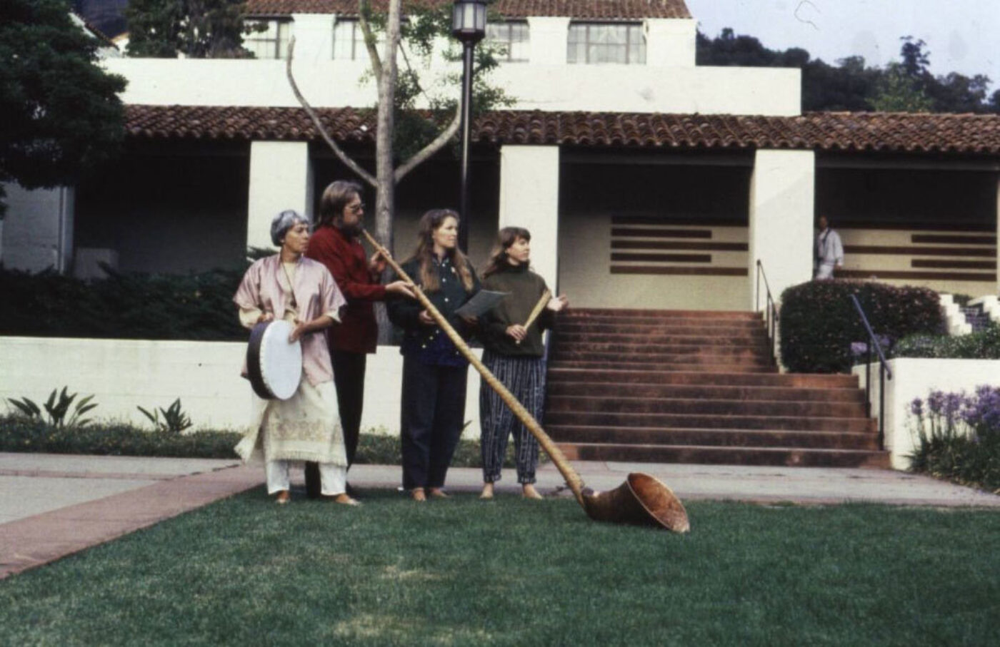

<!-- "#0056FF" data-background-gradient="linear-gradient(to bottom, #171c20d4, #466187)" -->
<section data-background-image="assets/images/AC76-0492.1.jpeg" data-background-opacity="0.3" data-state=header1>

    
</section>
<section data-background-color="#5cb17a" data-state=ande>
    
    <blockquote>
       (Designing) at the intersection of speculative fiction and anthropology, we find a sense of epistemic humility about the kind of worlds we could or should inhabit. (It) calls us to craft tangible ways of shaping and repairing the worlds we still hope for.
    </blockquote>
    <aside class="notes">
    </aside>
</section>
<section data-background-image="assets/images/Sun-Ra-06.jpg" data-background-opacity="0.3" data-state=sun>

    <h3>Speculative Ethnography</h3>
    
Design as a medium to imagine new Ideological Projects

    <aside class="notes">
    </aside>
</section>
<section data-background-image="assets/images/AC76-0492.1.jpeg" data-background-opacity="0.3" data-state=kesh>
    
    
    <aside class="notes">
    </aside>
</section>
<section data-background-image="assets/images/spaceElk.jpg" data-background-opacity="0.5" data-state=bez>

    <h3>Imaginaries as Infrastructure</h3>
    
Imaginaries as tangible spaces of investigation

    <aside class="notes">
    </aside>
</section>
<section data-background-image="assets/images/Oneill1.jpg" data-background-opacity="0.7" data-state=on>

    <aside class="notes">
    </aside>
</section>
<section data-background-image="assets/images/oneill_2.jpg" data-background-opacity="0.7" data-state=on>

    <aside class="notes">
    </aside>
</section>
<section data-background-image="assets/images/apolo_rov.jpg" data-background-opacity="0.7" data-state=header1>
    <h3>Objects As Narratives</h3>
    <aside class="notes">
    </aside>
</section>
<section data-background-image="assets/images/apolosim.jpg" data-background-opacity="0.7" data-state=header1>
    <aside class="notes">
    </aside>
</section>
<section data-background-image="assets/images/apolloWalking.jpg" data-background-opacity="0.7" data-state=header1>
    <aside class="notes">
    </aside>
</section>
<section data-background-color="#5cb17a" data-state=vvfa>
    
    <blockquote>
       IMAGINING OBJECTS, ARTEFACTS AND THINGS EMBODYING THE WORLD WITHIN WHICH THESE THINGS EXIST.
    </blockquote>
    <aside class="notes">
    </aside>
</section>
<section data-background-color="#5cb17a" data-state=vvfa>
    <blockquote>
       REVERSE ARCHAEOLOGY
    </blockquote>
    <aside class="notes">
    </aside>
</section>