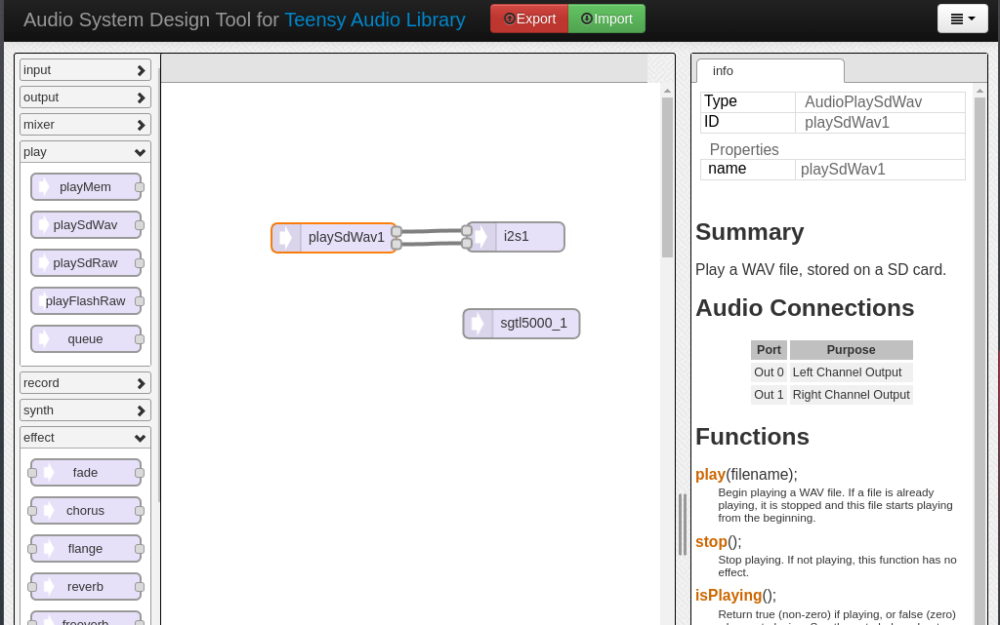

Music programming / Digital Signal Processing with [Teensy](https://www.pjrc.com/teensy/).

---

## LIGHT DEPENDENT RESISTOR (LDR) 

In this short segment, we will swap our potentiometer for a light dependent resistor also known as [photoresistor](https://en.wikipedia.org/wiki/Photoresistor).


Although various sensors can be connected to our board, the majority of analog sensors typically operate similarly, often featuring three pins, with two for power and one for the signal. Alternatively, sensors like LDRs may possess only two pins, acting as resistors that allow more or less current to pass through as light intensity fluctuates.


As illustrated in a prior section, potentiometers can function as voltage dividers, where the wiper adjustment alters the resistance ratio, resulting in a variable value at the central terminal. However, when working with a two-pin LDR, an additional component, a resistor, is required to establish a similar circuit. In this configuration, one of the LDR pins is linked to the power source, while the second pin is connected to our analog input. Simultaneously, this same pin needs to establish a connection to the ground through the aforementioned resistor. In this manner, variations in light intensity mimic the role of the wiper, altering the resistance ratio at the analog input pin.

### Connecting to our board

Once more, in the diagram provided below, an Arduino board is depicted instead of the Teensy, but the labeling and connections adhere to the same setup. It's apparent how closely related this configuration is to the potentiometer circuit.


Now, let's proceed to re-upload our initial drone sketch, which comprised solely the _waveform1_ object, the _I2s1_ output, and the _sgtl5000_1_ object. If the upload is successful, you should now have the ability to modulate the pitch of your drone by either exposing the LDR to light or conversely shielding it from any light source.

## PUSH BUTTON — BASIC DIGITAL INPUT

In embedded electronics, a digital input refers to an interface that accepts binary data or signals, typically in the form of high (logic 1) or low (logic 0) voltage levels, representing the 'on' or 'off' states. These inputs are commonly used to receive and process digital information from various external sources, such as switches, sensors, or other digital devices.

In this scenario, we will use a push button as our digital input source. A momentary push button is a type of switch that remains in the 'off' state when it is not being pressed, and is designed to be activated only when pressed.

### Push Button's Anatomy

A push button also known as _tactile push switch_, is typically comprised of a pair of electrical contacts encased within a housing. When the button is unpressed, the contacts remain apart, creating an open circuit. And when pressed, the contacts come into contact.


### Push Button's circuit

Once more, although the illustration below demonstrates connections to an Arduino board, the labeling remains consistent when applied to the Teensy board.


In our application, the pin connected to one terminal of the button is linked to ground (through a 10Kohm resistor), completing the low signal (0V) connection. However, upon pressing the button, an internal mechanism causes the contacts to come into contact, completing the circuit and allowing current to flow through. Consequently, the pin attached to the other terminal is now connected to the voltage source (3.3V), generating a high signal. 

**_Note: As we've previously learned, the pins on Teensy can serve various functions that can be assigned via programming. Consequently, the pin A0, initially utilized as an analog input, can be reassigned as a digital pin when necessary. However, within the code, we will refer to it as pin "14" instead of "A0."_**

### Push Button in code

To test our push button, we will initially use it to switch the built-in LED on and off, which is internally linked to digital pin 13.


let's quickly unpack the code:

```
void setup() {
  // put your setup code here, to run once:
  pinMode(14, INPUT);
  pinMode(13, OUTPUT);
}
```
In our `setup()` function, akin to our previous _Blink_ example, we use the `pinMode()` method to designate the functionality of the digital pins. Unlike analog pins that are invariably used as inputs, digital pins can function as either INPUT` or `OUTPUT`. Accordingly, we configure digital pin 14 as an input since we are acquiring the push button's state through it, and pin 13 as an output as it controls the built-in LED we aim to toggle.

```
void loop() {
  // put your main code here, to run repeatedly:
  if(digitalRead(14) == HIGH){
    digitalWrite(13, HIGH);
  }else{
    digitalWrite(13, LOW);
  }
}
```
Here, our `loop()` section contains what we call in programming a **if statement**. an _if statement_ in programming acts as a **conditional statement** that executes a block of code only if a specified condition is met. It allows for the implementation of decision-making processes in code, enabling the program to carry out different actions based on whether a certain condition evaluates to true or false.

Here, we aim to determine whether the push button is currently pressed or not. As seen earlier, if it is pressed we should read a `HIGH` signal, if it is not our signal is `LOW` Since we are solely interested in one specific condition, here we are solely checking whether the push button state is pressed, that is, if our pin is reading `HIGH`.

To read the state of a digital pin, we use the `digitalRead()` function, which requires the pin's identification number as an argument. To verify the condition, we use the `==` operator, distinct from the single `=` that is employed for assigning values to variables.

Plus, `digitalWrite` is used to "write" a value to the digital pin utilized as output. This function necessitates two arguments: the pin's identifier as the first argument, and the value we seek to assign as the second.

So in this case, we should read: "_if the value read on pin 14 is High, then set the value of pin 13 High. Otherwise set the value of pin 13 Low_".

If everything goes well, once the code uploaded, the built-in LED should turn on when the button is pressed, and off when it is released.

**_Note: if we did not set the pin 13 to `LOW` then the LED would stay on forever. In this context, the words `HIGH`, and `LOW` could be replaced by the value `1` and `0`._**

### Debouncing

In electronic, _debouncing_ refers to the process of ensuring the stable and consistent activation of a switch or button, eliminating any erroneous or extraneous readings caused by mechanical oscillations or bounces. Yet for our purposes, debouncing represents a means by which we can track when our push button's state has changed, particularly if its state shifted from `HIGH` to `LOW` (falling edge) or vice versa (rising edge). Although we could continuously and actively observe the push button state and create our own debouncing techniques from the beginning, we will instead use another library called the [Bounce2 library](https://github.com/thomasfredericks/Bounce2/blob/master/README.md). This library can be easily installed and added to your sketch through the library manager. Just search for "bounce2" in the search field.

To illustrate the use of this library, we will employ our push button to toggle the built-in LED, ensuring that pressing the button once will turn the LED on, while pressing it again will turn it off, and so forth.

Once the _Bounce2_ library installed, copy and pate the following code:

```
// debouncing library
#include <Bounce2.h>

int bounce_pin = 14;
int led_state = LOW;

// instantiate Bounce objec
Bounce pushButton = Bounce();

void setup() {
  // put your setup code here, to run once:
  pushButton.attach(bounce_pin, INPUT);
  pushButton.interval(5);

  pinMode(13, OUTPUT);
}

void loop() {
  // put your main code here, to run repeatedly:

  // needed for the debouncing to work
  pushButton.update();

  if(pushButton.changed()){
    if(pushButton.read() == LOW){
      led_state = !led_state;
      digitalWrite(13, led_state);
    }
  }
}
```

Similar to what we observed with the code extracted from the Teensy Audio System Design Tool, we need to include the _Bounce2 library_ in our code using `#include <Bounce2.h>`. Subsequently, we encounter the statement `int bounce_pin = 14;`. In programming, the term `int` represents "integer," which signifies whole numbers without fractional or decimal parts, distinct from the `float` data type mentioned earlier. This line declares a variable named `bounce_pin` that will store the value of the digital pin we are using as an input.

Next, we encounter the line `led_state = LOW;`, which initializes another variable responsible for tracking the LED's state and will be modified when the button is pressed. With this line, the variable is initially set to `LOW`. As mentioned before, the _Bounce2 library_ allows the usage of programming "objects." The statement `Bounce pushButton = Bounce();` creates an instance of the `Bounce` object and names it `pushButton`, similar to how we named our `AudioSynthWaveform` object `waveform1`. However, in this instance, we need to use the `Bounce()` function to declare it.

In the subsequent `setup()` section, it's important to note that the `pinMode()` function has been substituted with `pushButton.attach(bounce_pin, INPUT)`. This line informs our program that we want to link our object `pushButton` to the `bounce_pin` number and employ it as an `INPUT`. The subsequent statement, `pushButton.interval(5);`, instructs the program to monitor the state of `pushButton` every 5 milliseconds.

Finally, in the `loop()` section, we have `pushButton.update()`, which is necessary to monitor the `pushButton` state. The subsequent part involves two concatenated _if statements_. The first verifies if the `pushButton` state has changed using `if(pushButton.changed()){`. The second inspects if the current state of our `pushButton` is `LOW` following a detected change. To read the button's state, we use the `pushButton.read()`. If it is `LOW`, we modify the `led_state`. The statement `= !led_state` implies that the current value of `led_state` should be set to its opposite. The `!` operator, in certain cases, negates whatever it precedes. For instance, if you were attempting to write an _if statement_ that verifies something that _is not equal_, you would employ `!=` instead of `==`.

After updating the value of `led_state`, we proceed to write it to the LED pin 13, similar to what we did previously.

## TRIGGERING SOUND WITH A PUSH BUTTON 

### Envelopes

In our context, one possible application of a push button is to mimic the action of turning a note on and off, similar to pressing a piano key. However, a notable distinction exists: when a key is struck on a piano, a hammer strikes a string tuned to a particular frequency. This initially results in a loud note that gradually fades until it is inaudible. In other words, the amplitude or volume of the note changes over time. This fluctuation in amplitude is commonly referred to as an [envelope](https://en.wikipedia.org/wiki/Envelope_\(music\)).

To achieve something similar to the envelope of a piano key strike, we have the convenient `AudioEffectEnvelope` object, found in the _effect_ section of the [Audio System Design Tool](https://www.pjrc.com/teensy/gui/?info=AudioEffectEnvelope#).


In this example, we are routing our _waveform1_ signal through our _envelope1_ object, then to the audio output _i2s1_. This results in the sound of the waveform being audible only when the envelope is triggered.

After exporting this code to you arduino IDE, the start of your sketch should look like the following image. 


As you may have noted, all the `#include` statments are set at the top.

As previously seen the objects from the Audio System Design Tool are declared before the `setup()` section. Then This section also contains the statements that are related to them and that we have seen before such as `AudioMemory(10)`, `sgtl5000_1.enable()` and `sgtl5000_1.volume(0.8)` and all the parameters related to setting up `waveform1`.


Next, we encounter the `mapFloat()` function followed by the `loop()` section. This portion of the code assumes the presence of two analog inputs to control both the frequency of our `waveform1` and the _release_ time of our `envelope1`. As you might have noticed in the documentation for this object, the envelope is designed as a Delay-Hold-Attack-Decay-Sustain-Release (DHADSR) envelope. In our context, we will focus primarily on the _release_ component of this envelope for this example. The _release_ time of this envelope ranges from 0 to 11880 milliseconds.

The _if statements_ have also been slightly modified, it now "reads": 
_**if the state of the push button has changed, and if the push button's current state is HIGH then trigger the envelop and start the "note" and switch the LED on. However if the current state is LOW, turn off the "note" as well as the LED**_.

The `noteOn()` function signals the beginning of the envelope triggering process, allowing it to progress through its DHADS stages. However, as long as the button remains pressed, the note will be sustained. Only when the button is released does the `noteOff()` function activate, triggering the _release_ stage of the envelope.

```
// debouncing library
#include <Bounce2.h>
#include <Audio.h>
#include <Wire.h>
#include <SPI.h>
#include <SD.h>
#include <SerialFlash.h>

int bounce_pin = 14;
int led_state = LOW;

Bounce pushButton = Bounce();

// GUItool: begin automatically generated code
AudioSynthWaveform       waveform1;      //xy=64,234
AudioEffectEnvelope      envelope1;      //xy=224,222
AudioOutputI2S           i2s1;           //xy=382,208
AudioConnection          patchCord1(waveform1, envelope1);
AudioConnection          patchCord2(envelope1, 0, i2s1, 0);
AudioConnection          patchCord3(envelope1, 0, i2s1, 1);
AudioControlSGTL5000     sgtl5000_1;     //xy=393,281
// GUItool: end automatically generated code

void setup() {
  // put your setup code here, to run once:
  AudioMemory(10);
  // set up the hardware
  sgtl5000_1.enable();
  sgtl5000_1.volume(0.8);

  // set up our waveform object
  waveform1.frequency(440);
  waveform1.amplitude(1.0);
  waveform1.begin(WAVEFORM_SAWTOOTH);

  pushButton.attach(bounce_pin, INPUT);
  pushButton.interval(5);
  // pinMode(14, INPUT);
  pinMode(13, OUTPUT);
}

float mapfloat(float x, float in_min, float in_max, float out_min, float out_max)
{
  return (x - in_min) * (out_max - out_min) / (in_max - in_min) + out_min;
}


void loop() {
  // put your main code here, to run repeatedly:
  pushButton.update();

  // change the frequency
  float HZ = mapfloat(analogRead(A2), 0, 1023, 20.0, 2000.0);
  waveform1.frequency(HZ);

  // change the decaying time of the envelop
  float release = mapfloat(analogRead(A3), 0, 1023, 0, 11880);
  envelope1.release(release);

  if(pushButton.changed()){
    if(pushButton.read() == HIGH){
      envelope1.noteOn();
      // led_state = !led_state;
      digitalWrite(13, 1);
    }else if(pushButton.read() == LOW){
      envelope1.noteOff();
      digitalWrite(13, 0);
    }
  }
}
```

Once this code is uploaded, you should have a note playing that is activated by the button press.

### Playing WAV files from an SD card

One of the most convenient features of the Audio Shield is its built-in SD card slot, which allows us to easily stream WAV files from an SD card. Setting up this feature is remarkably simple, as it only requires connecting the `AudioPlaySdWav` object directly to the audio output.



Although our sketch might appear more complex, the majority of the added code is involved in establishing communication between our program and the SD card.
Here is a quick breakdown of the code:

In addition to the code generated by the online audio tool, we define three variables: `SDCARD_CS_PIN`, `SDCARD_MOSI_PIN`, and `SDCARD_SCK_PIN`. These represent the pins used by the SD card. It's important to note that pin 13 is being used, which means we won't be able to access the built-in LED as we did previously.

```
// debouncing library
#include <Bounce2.h>
#include <Audio.h>
#include <Wire.h>
#include <SPI.h>
#include <SD.h>
#include <SerialFlash.h>

// GUItool: begin automatically generated code
AudioPlaySdWav           playSdWav1;     //xy=177,159
AudioOutputI2S           i2s1;           //xy=363,158
AudioConnection          patchCord1(playSdWav1, 0, i2s1, 0);
AudioConnection          patchCord2(playSdWav1, 1, i2s1, 1);
AudioControlSGTL5000     sgtl5000_1;     //xy=369,247
// GUItool: end automatically generated code

// SD CARD variables
#define SDCARD_CS_PIN    10
#define SDCARD_MOSI_PIN  11  
#define SDCARD_SCK_PIN   13  
```
Subsequently, we define our variables related to the push button pin and the push button debouncing infrastructure.

In the `setup()` section, additional code is included to establish the [SPI](https://en.wikipedia.org/wiki/Serial_Peripheral_Interface) communication with the SD card using the previously defined pins. An `if` statement is added to handle the situation where the card isn't found.

The remaining code structure remains the same as before, with setup functions for our push button.

```
int bounce_pin = 14;

Bounce pushButton = Bounce();

void setup() {
  // put your setup code here, to run once:
  AudioMemory(10);
  // set up the hardware
  sgtl5000_1.enable();
  sgtl5000_1.volume(0.8);

  // set up SD CARD
  SPI.setMOSI(SDCARD_MOSI_PIN);
  SPI.setSCK(SDCARD_SCK_PIN);
  if (!(SD.begin(SDCARD_CS_PIN))) {
    // stop here, but print a message repetitively
    while (1) {
      // Do something here if the card is not detected
    }
  }

  pushButton.attach(bounce_pin, INPUT);
  pushButton.interval(5);
  pinMode(14, INPUT);
}
```

Before proceeding with the loop, we create an additional function to help manage the behaviour while the _WAV_ file is being streamed to the audio output. The `playFile()` function takes a `filename` as its only argument. Within this function, the `playSdWav1.play()` function is called on our object. While the `playSdWav1.isPlaying()` condition holds true, we can use our analog input `A2` to dynamically adjust the volume. 

```
float mapfloat(float x, float in_min, float in_max, float out_min, float out_max)
{
  return (x - in_min) * (out_max - out_min) / (in_max - in_min) + out_min;
}

void playFile(const char *filename)
{
  // Start playing the file.  This sketch continues to
  // run while the file plays.
  playSdWav1.play(filename);

  // A brief delay for the library read WAV info
  delay(25);

  // Simply wait for the file to finish playing.
  while (playSdWav1.isPlaying()) {
    float vol = mapfloat(analogRead(A2), 0, 1023, 0.0, 1.0);
    sgtl5000_1.volume(vol);
  }
}
```

Finally, in the `loop()`, the code checks whether the button has been pressed to initiate the playback of the file we have stored on the SD card.

```
void loop() {
  // put your main code here, to run repeatedly:
  pushButton.update();

  if(pushButton.changed()){
    if(pushButton.read() == LOW){
      playFile("SDCARD_1.WAV");
    }
  }
}
```

Here's the complete sketch for your convenience:

```
// debouncing library
#include <Bounce2.h>
#include <Audio.h>
#include <Wire.h>
#include <SPI.h>
#include <SD.h>
#include <SerialFlash.h>

// GUItool: begin automatically generated code
AudioPlaySdWav           playSdWav1;     //xy=177,159
AudioOutputI2S           i2s1;           //xy=363,158
AudioConnection          patchCord1(playSdWav1, 0, i2s1, 0);
AudioConnection          patchCord2(playSdWav1, 1, i2s1, 1);
AudioControlSGTL5000     sgtl5000_1;     //xy=369,247
// GUItool: end automatically generated code

// SD CARD variables
#define SDCARD_CS_PIN    10
#define SDCARD_MOSI_PIN  11  
#define SDCARD_SCK_PIN   13  


int bounce_pin = 14;
int led_state = LOW;

Bounce pushButton = Bounce();


void setup() {
  // put your setup code here, to run once:
  AudioMemory(10);
  // set up the hardware
  sgtl5000_1.enable();
  sgtl5000_1.volume(0.8);

  // set up SD CARD
  SPI.setMOSI(SDCARD_MOSI_PIN);
  SPI.setSCK(SDCARD_SCK_PIN);
  if (!(SD.begin(SDCARD_CS_PIN))) {
    // stop here, but print a message repetitively
    while (1) {
      // Do something here if the card is not detected
    }
  }

  pushButton.attach(bounce_pin, INPUT);
  pushButton.interval(5);
  pinMode(14, INPUT);
}
float mapfloat(float x, float in_min, float in_max, float out_min, float out_max)
{
  return (x - in_min) * (out_max - out_min) / (in_max - in_min) + out_min;
}

void playFile(const char *filename)
{
  // Start playing the file.  This sketch continues to
  // run while the file plays.
  playSdWav1.play(filename);

  // A brief delay for the library read WAV info
  delay(25);

  // Simply wait for the file to finish playing.
  while (playSdWav1.isPlaying()) {
    float vol = mapfloat(analogRead(A2), 0, 1023, 0.0, 1.0);
    sgtl5000_1.volume(vol);
  }
}

void loop() {
  // put your main code here, to run repeatedly:
  pushButton.update();

  if(pushButton.changed()){
    if(pushButton.read() == LOW){
      playFile("SDCARD_1.WAV");
    }
  }
}
```

## WHAT'S NEXT?

Congratulations on reaching the end of our short journey together in the world of Teensy and Arduino programming. I hope this provided you with a solid foundation and the necessary tools to delve deeper into the subject. It's important to stay curious and attentive as the tools and techniques in this field are constantly evolving and improving. Wishing you all the best in your continued exploration!

We have included valuable resources in the appendix. Here, you will find technical guides related to the framework we are using, as well as more theoretical materials relevant to your project. The technical resources feature comprehensive tutorials, including a YouTube video from the creators of Teensy and the Audio Shield. Additionally, all examples are conveniently accessible in the example folder of your IDE or directly on [GitHub](https://github.com/PaulStoffregen/Audio/tree/master/examples/Tutorial). 

The second technical tutorial is a comprehensive playlist where a music enthusiast takes you through the process of building a Teensy-based synthesizer step by step. Although the board they use may be older than what you have, the topics and techniques covered remain highly relevant. Moreover, they delve into subjects such as multiplexing, which could be beneficial if you ever need to work with many inputs.


---

> # APPENDIX 
> 
> ## INDEX
> 
> - [Kick off Slides](KICKOFF.md)
> - [Main Syllabus](./)
> - [An Intro to Teensy](TEENSY.md)
> - [An Intro to Audio on Teensy](FIRSTSOUND.md)
> - [Frequency Control](CONTROL.md)
> - [More Inputs](MOREINPUTS.md)
> - [Timetable & Key dates](README.md#timetable--2023)
>   
## TECHNICAL REFERENCES
>    
> - [More info on setting up your Teensy](https://www.pjrc.com/teensy/tutorial.html)
> - [Exploring the Audio Shield and Audio Library](https://youtu.be/wqt55OAabVs?si=5qlnqAItstBC24Dg)
> - [Building a Teensy Synth](https://youtube.com/playlist?list=PL4_gPbvyebyHi4VRZEOG9RKOYq5Hre3a1&si=4na8WX0SNsq3U0XX)
>   
## MISCELLANEOUS
>   
> - [FAUST Website](https://faust.grame.fr/)
> - [FAUST IDE](faustide.grame.fr)
> - [FAUST with Arduino](FAUSTARDUINO.md)
> - [Physical Modeling with FAUST](PM.md) 
> - [3D mesh2faust](https://github.com/grame-cncm/faust/blob/master-dev/tools/physicalModeling/mesh2faust/README.md)
> 
## THEORETICAL REFERENCES
> 
> - Rakotoniaina, S. & [NS-PDOS](https://www.youtube.com/@newschoolpolicyanddesignfo5504/vide) (2021),  [*Human Considerations, Speculations on Lunar Habitations*](https://www.youtube.com/watch?v=_fNXnpDgsec&t=353s&ab_channel=NewSchoolPolicyandDesignforOuterSpace). Italian Virtual Pavilion. Venice Architecture Biennale.
> - Loughridge, D. & Patteson, T. (2013),  [*Museum of imaginary musical instruments*](http://imaginaryinstruments.org/)
> - Eshun, K. (1999). _More Brilliant Than The Sun: Adventures In Sonic Fiction_. Quartet Books. ([https://monoskop.org/images/b/b2/Eshun_Kodwo_More_Brilliant_Than_the_Sun_Adventures_in_Sonic_Fiction.pdf](https://monoskop.org/images/b/b2/Eshun_Kodwo_More_Brilliant_Than_the_Sun_Adventures_in_Sonic_Fiction.pdf))
> - Anderson, R. et al. (2018, December 18), *Introduction: Speculative Anthropologies*. Society for Cultural Anthropology. ([https://culanth.org/fieldsights/introduction-speculative-anthropologies](https://culanth.org/fieldsights/introduction-speculative-anthropologies))
> - Davison-Vecchione, D. & Seeger, S. (2021). _Ursula Le Guin’s Speculative Anthropology: Thick Description, Historicity and Science Fiction_. Theory, Culture & Society. Sage Publication. ([https://journals.sagepub.com/doi/pdf/10.1177/02632764211051780](https://journals.sagepub.com/doi/pdf/10.1177/02632764211051780))
> - Kuh, A. (2015, January 14). _The Cultural Significance Of Space Exploration_. UK Space Agency. ([https://space.blog.gov.uk/2015/01/14/the-cultural-significance-of-space-exploration/](https://space.blog.gov.uk/2015/01/14/the-cultural-significance-of-space-exploration/))
> - Horniman Museum's [instrument collection](https://www.horniman.ac.uk/explore-the-collections/musical-instrument-collection/)
> - Beaudrillard, J. (1981). _Simulation And Simulacra_. Editions Galilee. ([https://archive.org/details/simulacra-and-simulation-1995-university-of-michigan-press/mode/2up](https://archive.org/details/simulacra-and-simulation-1995-university-of-michigan-press/mode/2up))

