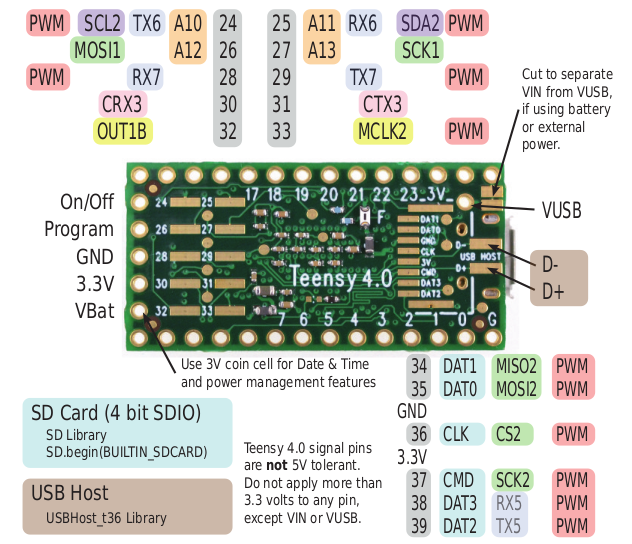
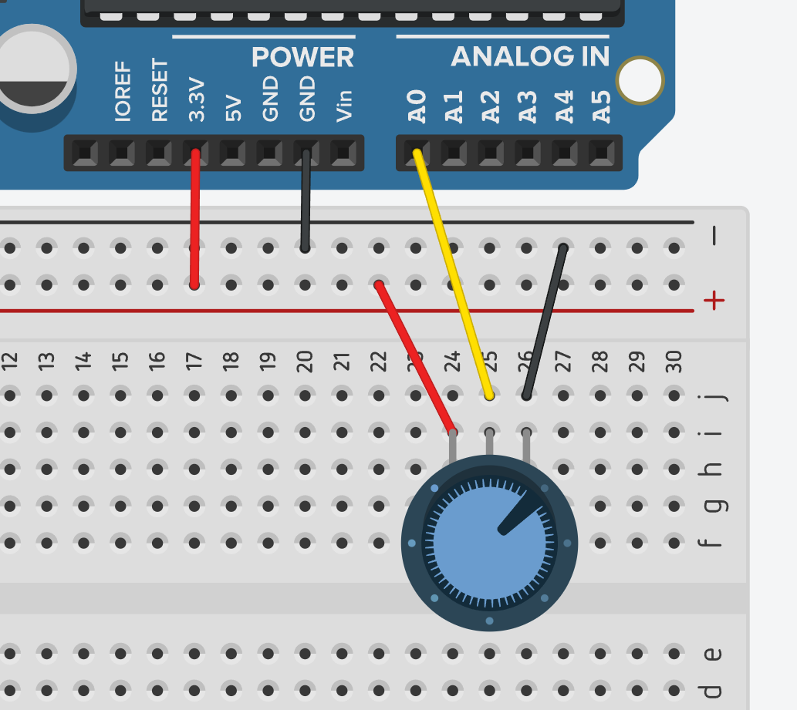
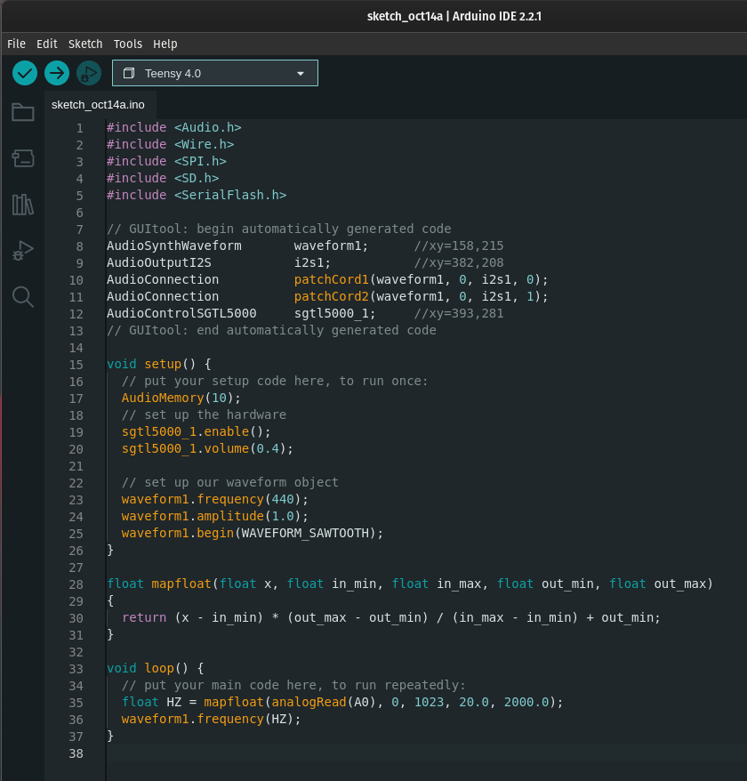
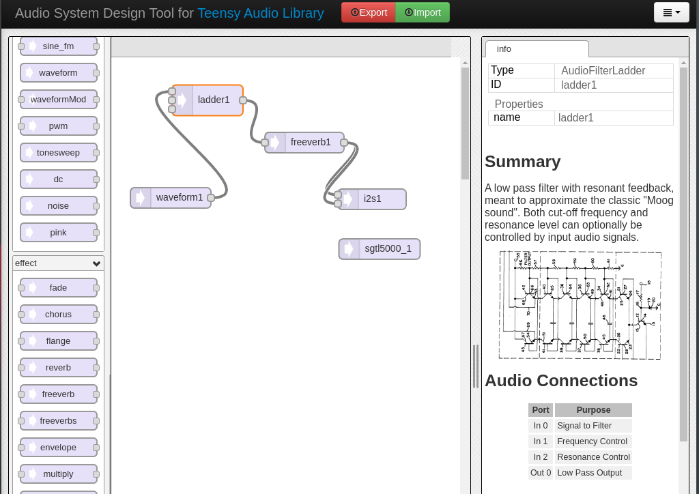
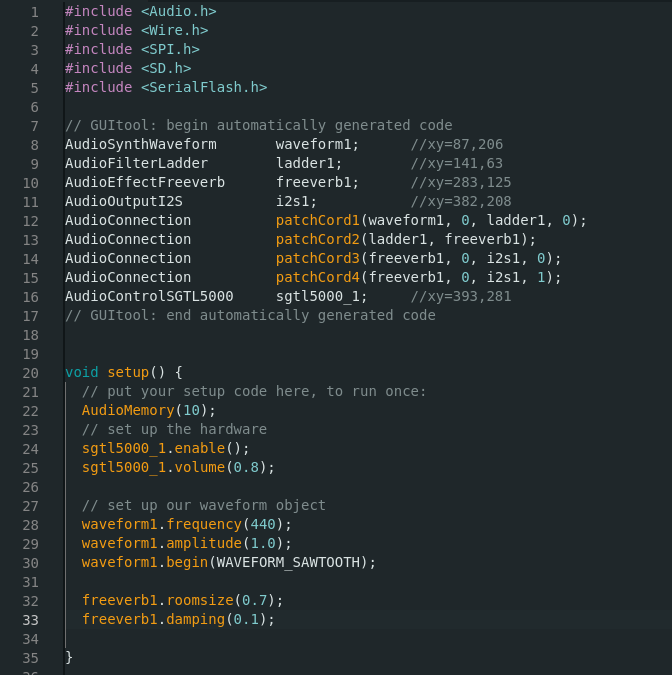
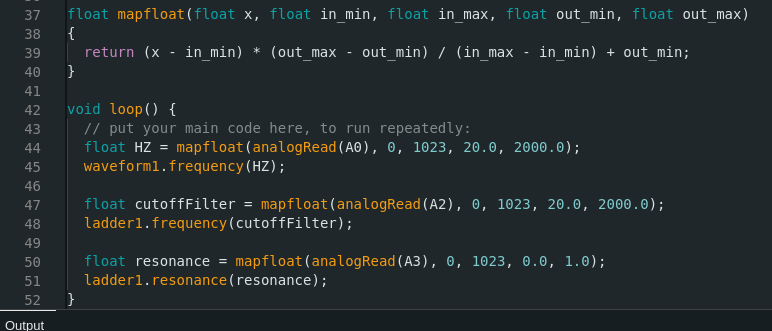
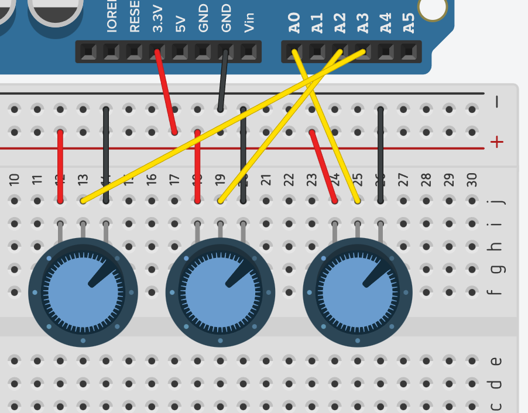

Music programming / Digital Signal Processing with [Teensy](https://www.pjrc.com/teensy/).

---

## ADDING CONTROL 

In this segment, we examine the process of integrating control via an analogue input. As we now have sound, exploring methods for controlling certain parameters becomes a natural next step. We will first use a potentiometer to change the frequency of our drone.

### What's analogue?

Analogue refers to a type of signal or sensor that provides a continuous range of values. Analogue sensors produce a voltage output that corresponds to real-world measurements, such as light, temperature, or distance. These sensors generate a variable signal that we can interpret and process to determine the physical quantity being measured. Analogue inputs in Arduino are used to read these continuous values and convert them into digital information for further computation or action. 

On Teensy boards, analogue inputs usually span from 0 to 3.3V. Once converted into digital data, this range corresponds to a numerical value between 0 and 1023.

### What's a potentiometer?

A potentiometer is a type of variable [resistor](https://en.wikipedia.org/wiki/Resistor) that enables us to control the resistance manually. It typically consists of a resistive element and a sliding contact, which can be moved across the resistive material, changing the resistance value. This adjustment results in a change of voltage or current in an electric circuit. Potentiometers are commonly used for volume controls in audio equipment, as well as for various other purposes such as controlling the brightness of a lamp or the speed of a motor.


By applying a voltage across the two outer terminals of the potentiometer and connecting the middle terminal to the circuit, the potentiometer acts as a voltage divider. As the slider of the potentiometer is adjusted, the ratio of the resistance changes, subsequently altering the voltage output at the middle terminal. This dynamic output voltage is determined by the position of the slider along the resistive element, allowing for precise and continuous control over the voltage supplied to the circuit.

### Connecting to the Teensy board

To establish a connection between a potentiometer and the Teensy board, it's essential to become acquainted with the pinout configuration of the board.

A pinout configuration refers to the layout or arrangement of pins on an electronic device, such as our Teensy 4.0 microcontroller board. It provides a comprehensive depiction of the functions and assignments of each pin, including details about power supply, input/output, communication interfaces, and other peripheral connections. Pinout configurations are crucial for understanding how to correctly interface and connect external components or modules to a specific device, ensuring proper communication and interaction between different hardware elements.

| Teensy 4.0 pinout — front | Teensy 4.0 pinout — back |
| ----- | ----- |
|  |  |

Several pins on our Teensy board are already allocated for various functions by the Audio Shield. Some are designated for sound input and output, while others are reserved for accessing the onboard SD card slot. 

Referring to the pinout table, specifically the front side pinout, we can see that digital pins 14 to 23 can also function as analogue pins labeled from _A0_ to _A9_. In our current scenario, the only available unused analog pins, not already allocated by our shield, are _A0_, _A2_, _A3_, and _A8_. These designations will be employed within our program to interact with the pins.

**Breadboard pinout:**

A breadboard is a fundamental prototyping tool used for building and testing circuits. It provides a platform for quickly and easily connecting electronic components without the need for soldering. A typical breadboard consists of a grid of holes, each of which is electrically connected to others in the same row or column. This design allows for the swift assembly of circuits by inserting various components and wires into the breadboard, facilitating the creation of temporary or prototype circuits for experimentation and testing purposes.


The diagram above illustrates the interconnection of the holes on your breadboard. Observe that the _power rails_ are horizontally linked, whereas the other holes are organized in short vertical rows of 5 connected holes each.

The term "power rails" is attributed to these specific rails due to their common usage in facilitating the connection of power and ground components on the breadboard.

**Connecting our potentiometer:** 

In this example, we will designate _A0_ as our chosen input pin. To establish the connection, we'll employ jumper wires to link the outer pins of our potentiometer — one to the ground (GND) pin and the other to the 3.3V pin on the Teensy board. Meanwhile, the central pin of the potentiometer will be connected to the _A0_ pin on the Teensy board.



Although the illustration above does not depict a Teensy board but an Arduino, it is worth noting that the pin labels and the connections to the potentiometer and breadboard remain identical.

### Programing our analogue input

Expanding upon our prior program, we will explore the process of obtaining analogue values from our potentiometer and converting them into frequencies for our continuous drone sound.



Let us now direct our attention to the final segment of the program. First by exploring the following block of code:

```
float mapfloat(float x, float in_min, float in_max, float out_min, float out_max)
{
  return (x - in_min) * (out_max - out_min) / (in_max - in_min) + out_min;
}
```
The code above constitutes the declaration of a function intended to convert a particular range of values into a distinct range. It is merely a declaration and is not operational until we invoke it elsewhere in our program.

**_A function in programming is a reusable block of code designed to perform a specific task._**

This function, termed `mapFloat`, returns a floating-point number, meaning a number with a decimal point. 

Its parameters, enclosed within the parentheses `(float x, float in_min, float in_max, float out_min, float out_max)`, are as follows: 

- `float x` denotes the number to be mapped onto a new range. 
- `float in_min` represents the minimum input value, and `float in_max` represents the maximum input value, encompassing the initial range under consideration. 
- `float out_min` and `float out_max` correspond to the new range we aim to map the value `float x` to.

By using this function, we can effectively map our converted analogue value, ranging from 0 to 1023 as previously [explained](#whats-analogue), into a corresponding frequency ranging between 20Hz and 2000Hz. The selection of this frequency range is arbitrary, intended to accommodate a musically applicable range.

Let's now look at our main `loop()` function:

```
void loop() {
  // put your main code here, to run repeatedly:
  float HZ = mapfloat(analogRead(A0), 0, 1023, 20.0, 2000.0);
  waveform1.frequency(HZ);
}
```

The initial line `float HZ = mapfloat(analogRead(A0), 0, 1023, 20.0, 2000.0);` invokes the function we just declared and described. Here, we establish a [variable](https://en.wikipedia.org/wiki/Variable_(computer_science)), `float HZ`, to store the value obtained from the use of the `mapFloat()` function. The term `HZ` has been arbitrarily selected to indicate that this variable will contain a value measured in Hertz.

As we have seen, the first parameter of the `mapFloat()` function represents our input value. To acquire the value from the potentiometer linked to our Teensy board at pin _A0_, we use the `analogRead()` function. This configuration effectively reads the incoming analogue value from pin _A0_. 

The following four parameters correspond to the two previously indicated ranges, namely 0 to 1023 and 20Hz to 2000Hz.

**_Both `analogRead()` and `mapFloat()` are functions; however, we did not need to declare `analogRead()` since this function is inherent to Arduino, unlike `mapFloat()`, which is a custom function we created._**

With our potentiometer connected to our Teensy board, we can now upload our program. Once running you should hear the pitch of the drone change as you rotate the potentiometer.

## FILTERING AND EFFECTS

Now that we have covered the fundamentals, we can readily and swiftly proceed to incorporate more interesting elements. Our next step involves integrating filtering and reverb into our system.

### Adding the filter and reverb blocks

Returning to the [Audio System Design Tool](https://www.pjrc.com/teensy/gui/), we will introduce two additional objects. Firstly, the _ladder_ block, located in the filter section on the left-hand side. This particular object serves as a resonant [low-pass filter](https://en.wikipedia.org/wiki/Low-pass_filter). Our intention is to use two more potentiometers to regulate both the filter's cutoff frequency and resonance parameters.

Subsequently, we will direct the filter's output to the input of the reverb module, followed by sending the output of our chain to the output object.



After linking all our blocks, we proceed to click on 'export,' followed by copying and pasting the resulting code into our Arduino sketch.



You might have observed that the exported code from our audio tool remained largely similar, except for the inclusion of the _ladder1_ and _freeverb1_ objects, along with the associated `AudioConnection` objects, denoting the connections we established.

Additionally, within our `setup()` function, we merely specified the parameters associated with the _freeverb1_ object, including the `roomsize()` and `damping()`. To gain a comprehensive understanding of these parameters and their potential values, I recommend referring to their descriptions in the audio system design tool.

The most notable modifications can be observed in the loop. Employing the same framework as the frequency control of our _waveform1_ object, we adjust it to cater to the requirements of the filter's cutoff frequency and resonance.

In this case, we use the analog pins _A2_ and _A3_ on the Teensy board to regulate these values.



In this scenario, we apply the same mapping values for the `cutoffFilter` variable, which will determine the filter's cutoff frequency. However, the `resonance()` parameter ranges from 0 to 1. Consequently, we must map our analog input value to suit this new range.

Once again, the names of the variables `HZ`, `cutoffFilter`, and `resonance` have been randomly chosen, reflecting the nature of the values they represent or their prospective purpose.

### Potentiometers

Once again, although the diagram below does not display a Teensy board, the labels and connections to be followed remain identical. Simply replicate your circuit from the original potentiometer, ensuring that each of the central pins of your potentiometers is correctly connected to the corresponding input on the board.



At this point, you should have a resonant drone sound with an echo effect, allowing you to adjust the frequency pitch and timbre by rotating the three potentiometers.

## [WHAT'S NEXT?](MOREINPUTS.md)
In the following segment, we will look at using [push buttons, light and sound as inputs](MOREINPUTS.md).

---

> # ANNEX 
> 
> ## INDEX
> 
> - [Main Syllabus](./)
> - [Introduction to Teensy](TEENSY.md)
> - [Audio on Teensy](FIRSTSOUND.md)
> - [Audio playback with FAUST](FAUSTPLAYBACK.md)
> - [GUI with FAUST](FAUSTGUI.md)
> - [FAUST with Arduino](FAUSTARDUINO.md) 
> - [Using sensors](SENSORS.md) 
> - [Physical Modeling with FAUST](PM.md) 
> - [Timetable & Key dates](README.md#timetable--2023)
>   
## OTHER RESOURCES
>   
> - [FAUST Website](https://faust.grame.fr/)
> - [FAUST IDE](faustide.grame.fr)
> - [Teensy set up](https://www.pjrc.com/teensy/tutorial.html)
>   
## MISCELLANEOUS
>   
> - [3D mesh2faust](https://github.com/grame-cncm/faust/blob/master-dev/tools/physicalModeling/mesh2faust/README.md)
> 
## OTHER REFERENCES
> 
> - Rakotoniaina, S. & [NS-PDOS](https://www.youtube.com/@newschoolpolicyanddesignfo5504/vide) (2021),  [*Human Considerations, Speculations on Lunar Habitations*](https://www.youtube.com/watch?v=_fNXnpDgsec&t=353s&ab_channel=NewSchoolPolicyandDesignforOuterSpace). Italian Virtual Pavilion. Venice Architecture Biennale.
> - Loughridge, D. & Patteson, T. (2013),  [*Museum of imaginary musical instruments*](http://imaginaryinstruments.org/)
> - Eshun, K. (1999). _More Brilliant Than The Sun: Adventures In Sonic Fiction_. Quartet Books. ([https://monoskop.org/images/b/b2/Eshun_Kodwo_More_Brilliant_Than_the_Sun_Adventures_in_Sonic_Fiction.pdf](https://monoskop.org/images/b/b2/Eshun_Kodwo_More_Brilliant_Than_the_Sun_Adventures_in_Sonic_Fiction.pdf))
> - Anderson, R. et al. (2018, December 18), *Introduction: Speculative Anthropologies*. Society for Cultural Anthropology. ([https://culanth.org/fieldsights/introduction-speculative-anthropologies](https://culanth.org/fieldsights/introduction-speculative-anthropologies))
> - Davison-Vecchione, D. & Seeger, S. (2021). _Ursula Le Guin’s Speculative Anthropology: Thick Description, Historicity and Science Fiction_. Theory, Culture & Society. Sage Publication. ([https://journals.sagepub.com/doi/pdf/10.1177/02632764211051780](https://journals.sagepub.com/doi/pdf/10.1177/02632764211051780))
> - Kuh, A. (2015, January 14). _The Cultural Significance Of Space Exploration_. UK Space Agency. ([https://space.blog.gov.uk/2015/01/14/the-cultural-significance-of-space-exploration/](https://space.blog.gov.uk/2015/01/14/the-cultural-significance-of-space-exploration/))
> - Horniman Museum's [instrument collection](https://www.horniman.ac.uk/explore-the-collections/musical-instrument-collection/)
> - Beaudrillard, J. (1981). _Simulation And Simulacra_. Editions Galilee. ([https://archive.org/details/simulacra-and-simulation-1995-university-of-michigan-press/mode/2up](https://archive.org/details/simulacra-and-simulation-1995-university-of-michigan-press/mode/2up))

