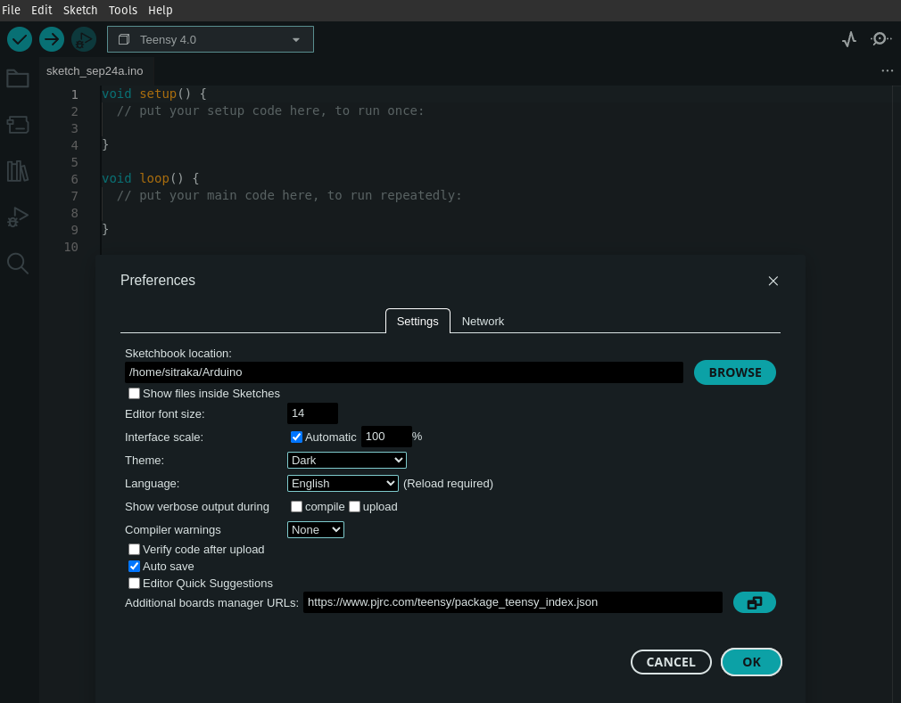
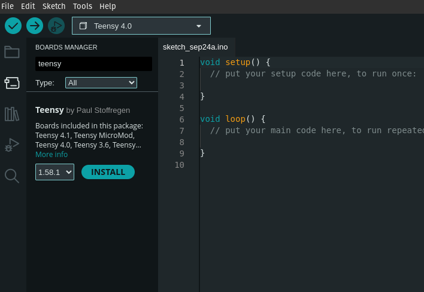
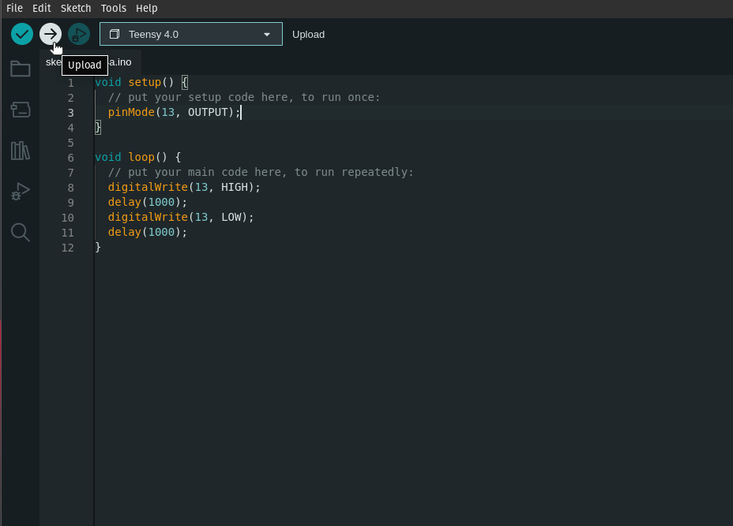

Music programming / Digital Signal Processing with [Teensy](https://www.pjrc.com/teensy/).

> The Teensy is a complete USB-based microcontroller development system, in a very small footprint, capable of implementing many types of [projects](https://www.pjrc.com/teensy/projects.html). All programming is done via the USB port.

Taken from [PJRC](https://www.pjrc.com/)'s website.

---

## INTRODUCTION

### What's Teensy? What about Arduino?

You have probably heard of [Arduino](https://www.arduino.cc/) before; it's a popular platform in the world of embedded electronics. At its core, an Arduino is a simple, user-friendly microcontroller development board that makes it easier for both beginners and experts to create a wide range of electronic projects. The main advantage of Arduino is its accessibility and robust community support. It's based on 8-bit ATmega microcontrollers, which are easy to use and have a broad ecosystem of add-on modules called shields. Arduino employs a simplified version of the C++ programming language, and its [integrated development environment](https://www.arduino.cc/en/software) (IDE) simplifies code writing and uploading to the board.

Now, let's delve into the Teensy platform. While it might not be as well-known as Arduino, it's a powerful alternative, especially for more complex projects. Teensy, like Arduino, is a development board, but it stands out due to its use of 32-bit ARM Cortex-M series microcontrollers. This architectural difference results in significantly higher processing power and clock speeds compared to Arduino's 8-bit platform. Teensy's performance makes it suitable for real-time applications and projects demanding extensive computational capabilities.

Both Arduino and Teensy share a commitment to open-source principles, allowing you to access their design files and libraries freely. Teensy is also programmed using the Arduino IDE and is seamlessly integrated since the release of the Arduino IDE 2.0.0.

Regarding hardware, both platforms offer a set of digital and analog input/output pins, making them versatile for interfacing with various sensors, actuators, and components. They are beginner-friendly, with a plethora of online tutorials and a supportive community.

In summary, when choosing between Arduino and Teensy, consider your project's computational requirements and your level of expertise. Arduino excels in simpler applications and benefits from a rich ecosystem, while Teensy's 32-bit architecture is ideal for demanding, performance-critical tasks. Many electronics enthusiasts find value in both platforms, selecting the one best suited to the specific needs of their projects.

### Why Teensy?

For our purpose, Teensy microcontrollers are exceptionally well-suited for real-time audio processing and sound generation due to their powerful hardware capabilities and the availability of specialised [audio libraries](https://www.pjrc.com/teensy/td_libs_Audio.html). 

Their high clock speeds and [digital signal processing](https://en.wikipedia.org/wiki/Digital_signal_processing) (DSP) capabilities make them capable of handling complex audio algorithms in real time, providing low-latency audio processing. 

Teensy boards also have dedicated [digital-to-analog converters](https://en.wikipedia.org/wiki/Digital-to-analog_converter) (DACs) and [analog-to-digital converters](https://en.wikipedia.org/wiki/Analog-to-digital_converter) (ADCs) that are optimised for high-quality audio output and input. Additionally, Teensy supports a range of [audio shields](https://www.pjrc.com/store/teensy3_audio.html) and add-ons, enabling users to create custom synthesizers, effects processors, and audio applications with ease. 

## Getting started

As mentioned in the introduction, the Arduino IDE can be, and will be used to program your Teensy board. 

### Step 1: Download the Arduino IDE

- Start by downloading the [Arduino IDE](https://www.arduino.cc/en/software) (Integrated Development Environment) from the official Arduino website.
- Make sure to Choose the 2.x.x version that matches your computer's operating system (Windows, Mac, or Linux) and run the installer and/or follow the installation instructions.

### Step 2: Add Teensy to the _Board Manager_

- Launch the Arduino IDE; Teensy's installation is made through Arduino's board manager.
- Click on `File > Preferences`. And in the `Additional boards managers URLs` field copy this link:
`https://www.pjrc.com/teensy/package_teensy_index.json`
then click `OK`.

**_Note: for more info please visit this [link](https://www.pjrc.com/teensy/td_download.html)_**.



### Step 3: Install Teensy from the _Board Manager_

- Select the Board Manager icon on the left hand side, and type `teensy` in the `Filter your search...` box.
- Click `Install`, the output tab should pop up and you should see the installing process being printed out.




### Step 4: Connect Your Teensy Board
- Connect your Teensy board to your computer using a micro USB cable. Your computer should automatically recognise the Teensy board, and it should appear in a dropdown meny at the top of the IDE. **_Note that the Teensy board version is the Teensy 4.0_**
- Select the Teensy 4.0 board from the dropdown menu, if it isn't automatically selected, or alternatively you can select it by clicking on `Tools > Board > Teensy > Teensy 4.0`

### Step 5: Write Your First Sketch
- To test that everything is working as it should copy and paste the following code in to your arduino sketch, then save your sketch by clicking on `File > Save as`.


```
void setup() {
  // put your setup code here, to run once:
  pinMode(13, OUTPUT);
}

void loop() {
  // put your main code here, to run repeatedly:
  digitalWrite(13, HIGH);
  delay(1000);
  digitalWrite(13, LOW);
  delay(1000);
}
```
- Alternatively you can access the same example, by clicking on `File > Examples > 01.Basics > Blink`. This code will result in the LED built-in the board to turn on and off every second _(or 1000 milliseconds)_.

### Step 6: Upload Your Sketch
- Click the right-pointing arrow icon (Upload) in the Arduino IDE to compile your code and upload it to your Teensy board.
- Monitor the progress bar at the bottom of the IDE, and your Teensy board should execute your program.



### [WHAT'S NEXT?](FIRSTSOUND.md)
If it all went well you should have the LED on your board blinking. Now that we are up and running let's create our [first sound](FIRSTSOUND.md).

---

> # ANNEX 
> 
> ## INDEX
> 
> - [Main Syllabus](./)
> - [Introduction to Teensy](TEENSY.md)
> - [Audio on Teensy](FIRSTSOUND.md)
> - [Audio playback with FAUST](FAUSTPLAYBACK.md)
> - [GUI with FAUST](FAUSTGUI.md)
> - [FAUST with Arduino](FAUSTARDUINO.md) 
> - [Using sensors](SENSORS.md) 
> - [Physical Modeling with FAUST](PM.md) 
> - [Timetable & Key dates](README.md#timetable--2023)
>   
## OTHER RESOURCES
>   
> - [FAUST Website](https://faust.grame.fr/)
> - [FAUST IDE](faustide.grame.fr)
> - [Teensy set up](https://www.pjrc.com/teensy/tutorial.html)
>   
## MISCELLANEOUS
>   
> - [3D mesh2faust](https://github.com/grame-cncm/faust/blob/master-dev/tools/physicalModeling/mesh2faust/README.md)
> 
## OTHER REFERENCES
> 
> - Rakotoniaina, S. & [NS-PDOS](https://www.youtube.com/@newschoolpolicyanddesignfo5504/vide) (2021),  [*Human Considerations, Speculations on Lunar Habitations*](https://www.youtube.com/watch?v=_fNXnpDgsec&t=353s&ab_channel=NewSchoolPolicyandDesignforOuterSpace). Italian Virtual Pavilion. Venice Architecture Biennale.
> - Loughridge, D. & Patteson, T. (2013),  [*Museum of imaginary musical instruments*](http://imaginaryinstruments.org/)
> - Eshun, K. (1999). _More Brilliant Than The Sun: Adventures In Sonic Fiction_. Quartet Books. ([https://monoskop.org/images/b/b2/Eshun_Kodwo_More_Brilliant_Than_the_Sun_Adventures_in_Sonic_Fiction.pdf](https://monoskop.org/images/b/b2/Eshun_Kodwo_More_Brilliant_Than_the_Sun_Adventures_in_Sonic_Fiction.pdf))
> - Anderson, R. et al. (2018, December 18), *Introduction: Speculative Anthropologies*. Society for Cultural Anthropology. ([https://culanth.org/fieldsights/introduction-speculative-anthropologies](https://culanth.org/fieldsights/introduction-speculative-anthropologies))
> - Davison-Vecchione, D. & Seeger, S. (2021). _Ursula Le Guin’s Speculative Anthropology: Thick Description, Historicity and Science Fiction_. Theory, Culture & Society. Sage Publication. ([https://journals.sagepub.com/doi/pdf/10.1177/02632764211051780](https://journals.sagepub.com/doi/pdf/10.1177/02632764211051780))
> - Kuh, A. (2015, January 14). _The Cultural Significance Of Space Exploration_. UK Space Agency. ([https://space.blog.gov.uk/2015/01/14/the-cultural-significance-of-space-exploration/](https://space.blog.gov.uk/2015/01/14/the-cultural-significance-of-space-exploration/))
> - Horniman Museum's [instrument collection](https://www.horniman.ac.uk/explore-the-collections/musical-instrument-collection/)
> - Beaudrillard, J. (1981). _Simulation And Simulacra_. Editions Galilee. ([https://archive.org/details/simulacra-and-simulation-1995-university-of-michigan-press/mode/2up](https://archive.org/details/simulacra-and-simulation-1995-university-of-michigan-press/mode/2up))

